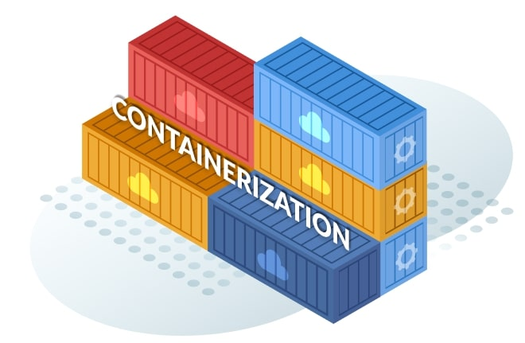
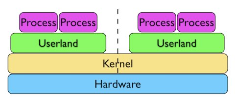
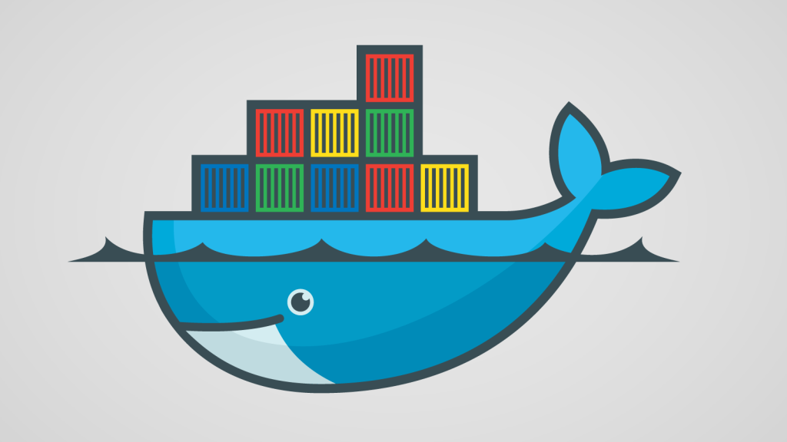
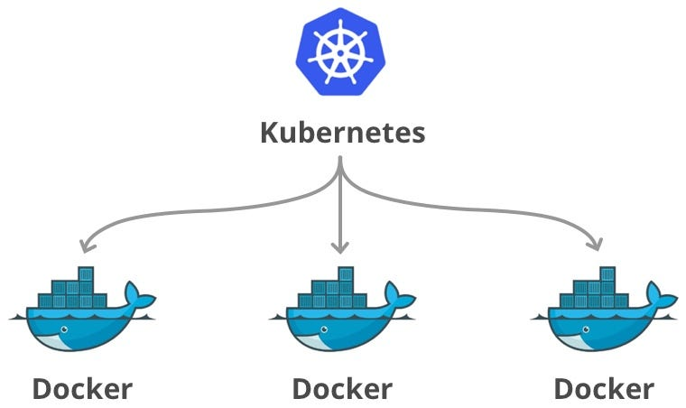
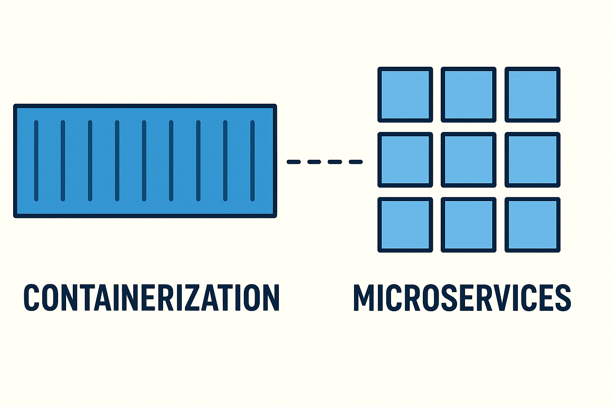

How Was the "It Works on My Machine, But Not on Yours!" Problem Solved? - The History of Container Formation and Evolution

> 🇮🇷 نسخهٔ فارسی:
> ../../posts/fa/containers-formation.md

Once upon a time, in a corner of this planet, there were some programmers who wrote genuinely good and clean code. But they had one big problem:

**Their programs wouldn't run on each other's systems!**

Interference from existing programs, files, and how the new program was processed was causing issues, and this was just the beginning! During development, choices of programming language, libraries, and packages also differed. These very differences made **team development slow and difficult**.

**And this is where the idea of the container was born: a simple solution to a big problem.**

The simplest analogy for a container is **shipping containers in the real world**. It doesn't matter if the container holds bananas or car parts; the container itself has a standard specification, and any ship or crane can move it.

In the software world, a container does exactly the same thing:

**A standard package that holds the application and all its dependencies (libraries, configurations, etc.) within itself.**

This package runs identically in any environment (developer's laptop, test server, or the cloud) and solves the "it only works on my machine!" problem forever.

Now, let's see how this idea took shape over time.

---

## 1979: The First Spark – **chroot in UNIX**

Let's look at it more simply:
"What if we could just copy the program and run it on any system?"

This idea led to the introduction of a feature called **chroot** in UNIX in **1979**.

chroot created a "fake root" for the filesystem; so that the program thought the entire system was only the folder assigned to it.

🔹 This was the first step towards **isolation**.

But it had limitations: it only isolated the filesystem, not other resources like the network, processes, or memory.

---

## 2000: **FreeBSD Jails**

Around the year **2000**, **Poul-Henning Kamp** along with a few others, developed the **FreeBSD Jails** project and integrated it into FreeBSD.

This feature was originally designed for **R&D Associates** company so they could run multiple isolated and secure environments for different services (web server, email, FTP, etc.) on a single server.

🔹 This was a pivotal moment in the evolution of system isolation.

> 📌 FreeBSD is an open-source UNIX-like operating system derived from BSD UNIX. BSD UNIX was developed at the University of California, Berkeley between 1975 and 1993.

---

### A Parallel Branch: Virtual Machines and Hypervisors (1990s–2000s)

While the concept of isolation was advancing in UNIX and FreeBSD Jails, a **separate path** was also forming in the world of technology: **Virtualization.**

Here, the isolation mechanism was done by a **Hypervisor**: each virtual machine had a complete operating system (Guest OS) and hardware resources were fully simulated and separated.

> 🔹 This branch actually ran parallel to the evolution of containers. VMs laid the foundation for modern data centers, but later, containers were introduced as a different approach for operating-system-level isolation with lower cost and higher speed.

**At a glance:**

- **Virtual Machine (VM):** Virtualizes hardware. Each VM has a separate, complete operating system (Guest OS) and is therefore heavier.

- **Container:** Virtualizes the operating system. All containers share the **host OS kernel** and are therefore much lighter and faster.

---

## 2006 to 2013: Laying the Foundation of Container Technology in Linux

During this period, the three main pillars of container technology in Linux were formed:

**1. cgroups (2006):** This capability, developed by Google engineers, initially started under the name **process containers** and provided the ability to manage and limit resources like CPU and memory. cgroups acts like a "resource supervisor."

**2. Linux Namespaces (2002–2013):** This feature gives processes an "isolated view" of the system. For example, a process in a network namespace only sees its own ports and network cards, not the entire system.

**3. LXC (2008):** This project was the first tool to combine `cgroups` and `namespaces` to provide a complete and functional containerized environment. LXC can be considered the grandfather of Docker.

---

## 2013: The Birth of **Docker** – A Revolution in the World of Containers

In **2013**, a project named **Docker** was introduced. It managed to present complex technologies like **cgroups** and **namespaces**, which were previously only accessible at a low level and to professional Linux users, in a **simple, understandable, and practical** form for everyone. Docker was initially built on **LXC**, but soon migrated towards its own runtime, **libcontainer**, to have more control over how containers run.

Docker's genius lay in several key innovations that introduced new concepts to this world:

- **Introducing the Image Concept:** Docker introduced a "build blueprint" or "template" called an **Image**. An image is a fixed, immutable package that contains all an application's requirements – from code and libraries to configurations. In fact, **a container is a running instance of an image**.

- **Using Layered Images:** Docker's main intelligence was in designing these images as **layered**. Each instruction in the image building process creates a new layer. This layered structure allowed for tremendous space savings and increased speed, because layers common between multiple images are stored and reused only once.

- **Creating a Public Registry (Docker Hub):** Docker provided a space akin to "GitHub for images" called **Docker Hub**. Developers could publish their own images there or use ready-made images from others.

- **Providing Simple, Developer-Friendly Tools:** With simple commands like `docker build`, `docker run`, and `docker push`, Docker turned the complex process of building and managing containers into a smooth and enjoyable task for developers.

These innovations **transformed containers from a complex infrastructure technology into an everyday tool for developers** and subsequently paved the way for modern trends like **DevOps, CI/CD**, and ultimately **Kubernetes**.

---

## 2015–2016: Agreeing on a Common Rulebook (OCI)

With Docker's popularity, other tools for working with containers were also built. This created a major risk: imagine if every car manufacturer produced its own special fuel! In that case, you could only use that company's gas stations.

To prevent such a problem in the world of containers, Docker and the Linux Foundation came together and wrote a **common rulebook** called the **Open Container Initiative (OCI)**.

This rulebook specified two main things for everyone:

1.  **A Standard Format for Images:** Everyone agreed that the build blueprint for containers (images) must have a single, unified shape and structure.

2.  **A Standard Method for Execution:** Everyone agreed that the "engine" that runs containers (called the **Runtime**) must follow the same commands.

🔹 As a result, you could build an image with Company A's tool and run it with Company B's tool. This agreement brought **compatibility and freedom of choice** for all and prevented users from being locked into a specific tool.

---

## 2014 to Today: Managing Containers Like a Conductor!

Docker had made it easy to run and manage a few containers. But when the number of containers reached hundreds or thousands and they were spread across different servers, a major challenge arose:

_Who manages this large group? If a container crashes, who restarts it? How is the workload distributed among them?_

This is where a tool for **automated leadership and management** of containers was needed. This process is called **Orchestration**.

In response to this need, Google introduced an open-source project called **Kubernetes** in **2014**. Kubernetes, built on the experience of managing billions of containers in its internal system (Borg), quickly became the most popular and powerful "orchestra conductor" in the world of containers, turning into the industry standard for managing large-scale applications.

> 📌 Google open-sourced this project in **June 2014** and later donated it to the CNCF (Cloud Native Computing Foundation).

---

## Today: A Mature Ecosystem

> Today, containers are no longer just tools for running applications; they have become the **backbone of cloud infrastructure, microservices, and modern software architectures**. **From video streaming services to banking apps and AI, almost all modern digital services run on containers.**

 Key features of today's containers:

- **Portability:**
    A program once packaged inside a container runs unchanged in any environment (from a laptop to a data center or public cloud).

- **Scalability:**
    Containers are lightweight and fast; this allows thousands of services to scale up or down in fractions of a second. This is essential for microservices architectures.

- **Integration with DevOps:**
    Containers allow teams to fully automate and make the development, test, and deployment cycle (CI/CD) repeatable.

- **Standardization of Environments:**
    Since everything is defined inside the container, "but it works on my machine" practically no longer exists.

- **Security and Isolation:**
    Each service runs in a separate space; therefore, the failure or attack on one service does not necessarily affect the others.

---

# References:
1. IBM – «What Is Containerization?»  
    [https://www.ibm.com/topics/containerization](https://www.ibm.com/topics/containerization)

2. Veeam – «Virtualization vs. Containerization: Key Differences»  
    [https://www.veeam.com/blog/virtualization-vs-containerization.html](https://www.veeam.com/blog/virtualization-vs-containerization.html)

3. Ubuntu – «Containerization vs. Virtualization: understand the differences»  
    [https://ubuntu.com/blog/containerization-vs-virtualization](https://ubuntu.com/blog/containerization-vs-virtualization)

4. Docker Docs – Official Docker documentation on containers  
    [https://docs.docker.com/get-started/overview/](https://docs.docker.com/get-started/overview/)

5. Kubernetes – Official documentation, "Overview" section  
    [https://kubernetes.io/docs/concepts/overview/what-is-kubernetes/](https://kubernetes.io/docs/concepts/overview/what-is-kubernetes/)

6. Red Hat – «What is container orchestration?»  
    [https://www.redhat.com/en/topics/containers/what-is-container-orchestration](https://www.redhat.com/en/topics/containers/what-is-container-orchestration)

 ChatGPT, Gemini, and other AI models were also used for gathering and editing the article.

---

### Image Sources:
docker :
https://techcrunch.com/2015/08/26/googles-container-engine-for-running-docker-containers-on-its-cloud-platform-is-now-generally-avaiable/

chroot shema : https://securityqueens.co.uk/im-in-chroot-jail-get-me-out-of-here/

jails shema : https://opentodo.net/2012/11/implementation-of-freebsd-jails-part-i/

kubernetes docker relaion : https://blog.devops.dev/devops-zero-to-hero-day-6-docker-and-kubernetes-mastering-containerization-and-f0dda804e7da

virtual machines VS. containers :
https://www.virtasant.com/blog/hypervisors-a-comprehensive-guide

microservices containers concept : chatGPT image generator

---

## ❓ Questions and Answers (FAQ) – Addressing Common Ambiguities About Container History

---

### ❓ Did nothing happen from 1980 to 2000? Why is this period so quiet?

This is a very good question. This "twenty-year silence" was actually a period when the computer world was busy solving other problems. The main focus in those years was on **personal computers (PCs)** and desktop operating systems, not on running applications in isolated environments at scale. Also, the internet hadn't yet taken its modern form, and there wasn't a felt need for extensive isolation. During this same period, a separate path called **Virtual Machines (VMs)** was also growing, which provided isolation at the full operating system level. Consequently, the ground for the emergence of modern containers was only prepared in the late 1990s with the growth of the web.

Of course, during this period, tools like **Solaris Zones (early 2000s)** and **AIX Workload Partitions** were also founded. Solaris Zones, in particular, had a significant influence on later containers.

---

### ❓ When Virtual Machines (VMs) existed, why did we still need containers?

Virtual Machines provided very strong, low-level isolation, but they were **very heavy**. Each VM needed a complete operating system with its own kernel and consumed a lot of resources. In contrast, containers, by using the host kernel and without running a separate OS, can start in seconds and have much lower resource consumption. Therefore, containers are particularly more suitable for development, rapid deployment, and scalability in modern environments.

---

### ❓ What's the main difference between a container and a virtual machine?

A Virtual Machine (VM) is a fully simulated system that includes its own independent operating system and kernel. In fact, each VM runs like a complete computer on virtual hardware and is managed by a tool called a Hypervisor. This method has very strong isolation, but running VMs is time-consuming and consumes a lot of resources (like RAM and CPU).

In contrast, containers only isolate the working space of an application and all run on the shared kernel of the host operating system. This means containers start much faster (within seconds) and are far lighter. But because they share a kernel, their isolation is at a lower level.

Since containers use the host operating system's kernel, they must be compatible with it. For example, you cannot directly run a Windows container on Linux. However, Windows, using a feature called **WSL2** (Windows Subsystem for Linux), has made it possible to run Linux containers on itself, which is itself a kind of combination of VM and container, allowing developers to have an experience closer to Linux on Windows.

---

### ❓ So what need did Kubernetes address that Docker alone couldn't?

Docker is excellent for building and running containers, but when it comes to **running hundreds or thousands of containers across multiple servers**, we need a tool that **manages, scales, monitors, and automates** everything. Kubernetes does exactly that: from **self-healing** to **Service Discovery**, **auto-scaling**, **version rollouts**, and resource management. Kubernetes is designed for running containers at an industrial scale.

---

### ❓ Are containers as secure as virtual machines?

Not exactly. Because containers share a **common kernel**, if there is a vulnerability in the host kernel, all containers are at risk. However, there are tools and methods to enhance container security; such as using **user namespaces, seccomp, AppArmor**, and security scanning tools. In sensitive environments, combining containers and VMs can provide better security.

---

### ❓ Do containers only run on Linux? What about Windows?

Containers were initially built on Linux, but today **Windows also supports containers** (Windows Containers). Also, with tools like **WSL2** (Windows Subsystem for Linux) and **Docker Desktop**, we can run Linux containers on Windows as well. However, the performance and capabilities of Linux containers are still more mature and extensive than Windows.